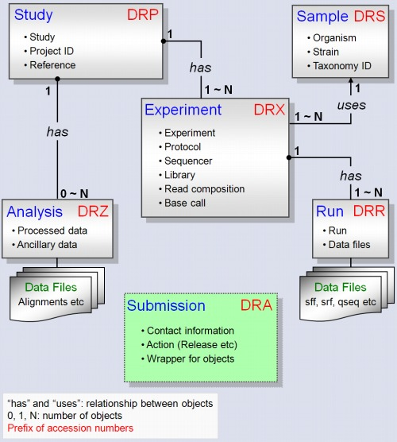

## SRA database structure
<center>

</center>

--- 

## Exploring SRA database

```{r}

# Set path
setwd("/home/joseah/Documents/jeff_leek_lab/SRA")

# Load library
library(RSQLite)

# Path of sqlite file
sqlfile <- "/home/joseah/SRAmetadb.sqlite"

# Create connection
sra_con <- dbConnect(SQLite(),sqlfile)

```

--- 

```{r results = 'asis'}
tables <- data.frame(dbListTables(sra_con)); knitr::kable(tables, col.names ="Tables")


```

---

```{r results = 'asis'}
fields_col_des <- dbListFields(sra_con, "col_desc")
knitr::kable(fields_col_des, col.names ="col_desc table")
query <- 
  "SELECT table_name, field_name, description 
  FROM col_desc 
  WHERE table_name = 'study' OR table_name = 'experiment' OR 
  table_name = 'sample' OR table_name = 'run';"
x <- dbGetQuery(sra_con, query)


```

---

### Table descriptions

```{r echo = FALSE, results='asis'}

dynamic_table <- DT::datatable(x, filter = 'bottom', options = list(pageLength = 6))
DT::saveWidget(dynamic_table, 'table_descriptions.html')
cat('<iframe src="table_descriptions.html"> </iframe>')


```

---

### Examples with selected important fields

```{r echo = FALSE, results='asis'}

query <- "SELECT exp.experiment_accession, exp.study_accession, exp.sample_accession, 
ru.run_accession, sub.submission_accession,
sam.center_name 'sam.center_name',
sam.taxon_id,
sam.scientific_name,
sam.description 'sam.description',
sam.sample_attribute,
sam.sradb_updated 'sam.sradb_updated',
stu.study_title,
stu.study_type,
stu.center_project_name,
stu.study_description,
stu.study_attribute,
stu.sradb_updated 'stu.sradb_updated',
ru.instrument_name,
ru.run_date,
ru.run_center,
ru.experiment_name,
ru.run_attribute,
ru.sradb_updated 'ru.sradb_updated',
exp.center_name 'exp.center_name',
exp.study_name,
exp.design_description,
exp.sample_name,
exp.library_name,
exp.library_strategy,
exp.library_source,
exp.library_selection,
exp.library_layout,
exp.targeted_loci,
exp.library_construction_protocol,
exp.spot_length,
exp.adapter_spec,
exp.read_spec,
exp.platform,
exp.instrument_model,
exp.platform_parameters,
exp.sequence_space,
exp.base_caller,
exp.quality_scorer,
exp.qtype,
exp.experiment_attribute,
exp.sradb_updated 'exp.sradb_updated'
FROM sample sam, experiment exp, study stu, run ru, submission sub 
WHERE sam.sample_accession = exp.sample_accession AND 
exp.study_accession= stu.study_accession AND 
exp.experiment_accession = ru.experiment_accession AND
sub.submission_accession = exp.submission_accession AND
sub.submission_accession = stu.submission_accession AND
sub.submission_accession = sam.submission_accession AND
sub.submission_accession = ru.submission_accession AND
exp.instrument_model LIKE '%illumina%' AND
exp.experiment_accession = 'ERX329153' AND 
exp.study_accession = 'ERP004078' AND
exp.sample_accession = 'ERS359934' AND
ru.run_accession = 'ERR356365' AND
sub.submission_accession = 'ERA258020';"
    			
study_1 <- dbGetQuery(sra_con, query)
  			

query <- "SELECT exp.experiment_accession, exp.study_accession, exp.sample_accession, 
ru.run_accession, sub.submission_accession,
sam.center_name 'sam.center_name',
sam.taxon_id,
sam.scientific_name,
sam.description 'sam.description',
sam.sample_attribute,
sam.sradb_updated 'sam.sradb_updated',
stu.study_title,
stu.study_type,
stu.center_project_name,
stu.study_description,
stu.study_attribute,
stu.sradb_updated 'stu.sradb_updated',
ru.instrument_name,
ru.run_date,
ru.run_center,
ru.experiment_name,
ru.run_attribute,
ru.sradb_updated 'ru.sradb_updated',
exp.center_name 'exp.center_name',
exp.study_name,
exp.design_description,
exp.sample_name,
exp.library_name,
exp.library_strategy,
exp.library_source,
exp.library_selection,
exp.library_layout,
exp.targeted_loci,
exp.library_construction_protocol,
exp.spot_length,
exp.adapter_spec,
exp.read_spec,
exp.platform,
exp.instrument_model,
exp.platform_parameters,
exp.sequence_space,
exp.base_caller,
exp.quality_scorer,
exp.qtype,
exp.experiment_attribute,
exp.sradb_updated 'exp.sradb_updated'
FROM sample sam, experiment exp, study stu, run ru, submission sub 
WHERE sam.sample_accession = exp.sample_accession AND 
exp.study_accession= stu.study_accession AND 
exp.experiment_accession = ru.experiment_accession AND
sub.submission_accession = exp.submission_accession AND
sub.submission_accession = stu.submission_accession AND
sub.submission_accession = sam.submission_accession AND
sub.submission_accession = ru.submission_accession AND
exp.instrument_model LIKE '%illumina%' AND
exp.experiment_accession = 'SRX038501' AND 
exp.study_accession = 'SRP005342' AND
exp.sample_accession = 'SRS152655' AND
ru.run_accession = 'SRR094185' AND
sub.submission_accession = 'SRA029165';"
  			
study_2 <- dbGetQuery(sra_con, query)
selected <- rbind(study_1, study_2)
query <-  paste("SELECT run_accession, file_name, md5, bytes, sradb_updated FROM fastq WHERE run_accession IN ('", 
               paste(selected$run_accession, collapse="', '"), "')", sep = "")
fastq_namefiles <- dbGetQuery(sra_con, query)
metadata <- merge(selected, fastq_namefiles, by = "run_accession")

get.fastq.urls <- function(df){
  url <- rep(NA, length(df$run_accession))
  for(i in 1:length(df$run_accession)) {
    run <- df$run_accession[i]
    filename <- df$file_name[i]
    if(nchar(run) < 10) {
      url[i] <- file.path('ftp://ftp.sra.ebi.ac.uk/vol1/fastq', substring(run, 1, 6), run, filename)
    } else {
      dir2 <- paste( c(rep(x='0', 12-nchar(run)), substring(run, 10, nchar(run)) ), collapse = '' )
      url[i] <- file.path('ftp://ftp.sra.ebi.ac.uk/vol1/fastq', substring(run, 1, 6), dir2, run, filename)
    }  
  }
  return(url)
}
metadata$URL <- get.fastq.urls(metadata)

search.field <- function(column, field){
  r <- paste0('.*\\|?\\|?', field,': (.*?) \\|?\\|.*|.*\\|?\\|?', field, ': (.*?)\\|?\\|?.*?')
  res <- sub(r, "\\1", column, perl = TRUE, ignore.case = TRUE)
  unlist(lapply(res, function(x) if(grepl(".*\\|\\|.*", x) == TRUE){return(NA)} else{return(x)}))
}

# Get population
metadata$population <- search.field(metadata$sample_attribute, "population")

# Get cell line / ID for individuals
metadata$cell_line <- search.field(metadata$sample_attribute, "cell line")
metadata$individual <- search.field(metadata$sample_attribute, "individual")

# Get sex of individuals
metadata$sex <- search.field(metadata$sample_attribute, "sex")

# Get source type of samples
metadata$strain <- search.field(metadata$sample_attribute, "Strain")
metadata$source_name <- search.field(metadata$sample_attribute, "source_name")

dynamic_table <- DT::datatable(t(metadata), filter = 'bottom', options = list(pageLength = 8))
DT::saveWidget(dynamic_table, 'query.html')
cat('<iframe src="query.html"> </iframe>')


```

---

```{r echo =FALSE, results = 'hide', message = FALSE}
dbDisconnect(sra_con)
```

## Conclusions (1)

- 57 fields were selected from the following tables:
  - Study 
  - Experiment
  - Sample
  - Run
- The **sample_attribute** field contains important information about ethnicity, sex, cell line, etc. Most of the time, this field is homogenous.
- We can look for the information about ethnicity in other fields.

---

## Conclusions (2)
- We could potentially analyze data divided into some categories as:
  - Sex
  - Ethnicity (differences in expression due to ancestry)
  - Cell line (diferential expression among different cell lines)
  - Center (Looking for batch effects)
  - Platform models
  - Date of submission (differences between older and new platforms)
  - Library selection (differences between the methods used to select and/or enrich the material being sequenced)


---
```{r results = 'asis', message = FALSE}
options(width = 120)
devtools::session_info()
```


